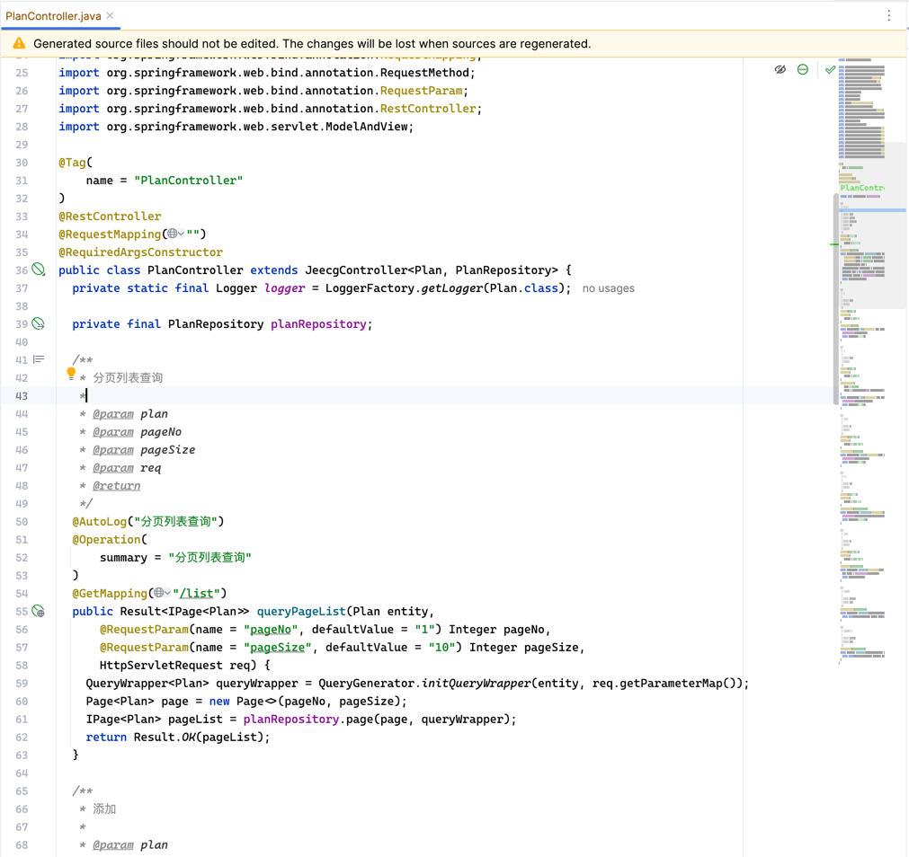

# Norbo 创建 Mybatis-plus 使用的 DAO 层对象

利用 Pluggable Annotation Processing API 和 [Java Poet](https://github.com/square/javapoet) 实现代码生成，目前状态为 <del>GA</del> 能用。

由于项目仅发布了 SNAPSHOT 版本，需要添加 SNAPSHOT 仓库地址。

```xml
<dependency>
  <groupId>cc.ddrpa.dorian</groupId>
  <artifactId>norbo</artifactId>
  <version>0.0.2-SNAPSHOT</version>
</dependency>
```

在需要使用的 POJO 类上添加注解

```java
@MPMapper
@MPRepository
@JeecgBootController
public class Plan {

    private Long id;
    private String name;
    private String head;
}
```

norbo 已经声明了自己是一个 Annotation Processor，因此是开箱即用的。不过如果你在 maven-compiler-plugin 显式地声明了 lombok 等注解处理器，同样也需要在 `<annotationProcessorPaths>` 中声明 norbo。

```xml
<plugin>
    <groupId>org.apache.maven.plugins</groupId>
    <artifactId>maven-compiler-plugin</artifactId>
    <configuration>
        <annotationProcessorPaths>
            <path>
                <groupId>cc.ddrpa.dorian</groupId>
                <artifactId>norbo</artifactId>
                <version>0.0.2-SNAPSHOT</version>
            </path>
...
```

执行 `mvn compile` 命令，在 `target/generated-sources/` 中查看生成的代码。

`cc.ddrpa.dorian.norbo.mabtisplus.annotation.MPMapper` 负责生成 Mapper 类。

```java
package xxxxxxx.xxx.xx;

import com.baomidou.mybatisplus.core.mapper.BaseMapper;
import org.apache.ibatis.annotations.Mapper;

@Mapper
public interface PlanMapper extends BaseMapper<Plan> {
}
```

`cc.ddrpa.dorian.norbo.mabtisplus.annotation.MPRepository` 负责生成 Service 类。

```java
package xxxxxxx.xxx.xx;

import com.baomidou.mybatisplus.extension.service.impl.ServiceImpl;
import org.springframework.stereotype.Service;

@Service
public class PlanRepository extends ServiceImpl<PlanMapper, Plan> {
}
```

`cc.ddrpa.dorian.norbo.jeecgboot.annotation.JeecgBootController` 负责生成 Jeecg Boot 风格的 Controller 类，该功能是暂时的，会在将来进行调整。

